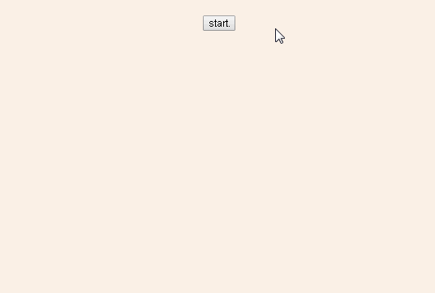

# vue-text-dot
A vue component that imitate typing text.

## Installation
``` bash
npm install vue-typewriter --save
```
and in your component:

``` javascript
import typewriter from 'vue-typewriter'
```

## Usage

``` html
<typewriter ref="typewriter" :interval="50">
  <!-- elements that u want to type -->
</typewriter>
```

## Props
| Name | Type | Required | Default | Description |
| ---:| --- | --- | --- | --- |
| interval | Number | false | 75 | time interval to type |


## Demo
<p align="center">
  
</p>

``` html
<template>
  <div>
    <button @click="type">start.</button>
    <typewriter class="tl" ref="typewriter" :interval="50" :style="{visibility: status}">
      <div class="comments">
        <p>/**</p>
        <p><span class="space"></span>*imitate typing</p>
        <p>*/</p>
      </div>
    </typewriter>
  </div>
</template>
```
``` javascript
import typewriter from 'vue-typewriter'
...
 {
   ...
   components: { typewriter, ... },
   data () {
     return {
       ...
       status: 'hidden'
       ...
     }
   },
   methods: {
     // $emit
     type () {
       this.status = 'visible'
       this.$refs.typewriter.$emit('typewrite')
     }
   }
 }
...
```
## TODO
 support typing space and html labels
